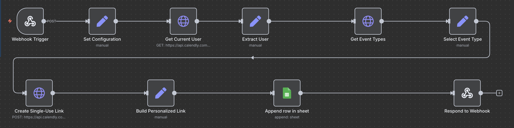

# Calendly Booking Link Generator (n8n)

This project generates **personalized Calendly booking links** using **n8n webhooks**.

---

## 🚀 Features
- Accepts name & email via webhook
- Generates personalized Calendly booking links
- Supports single-use or parameterized links
- Logs booking data to Google Sheets
- Returns clean JSON response

---

## 🧰 Tech Stack
- n8n (Cloud)
- Calendly API
- Google Sheets
- REST Webhooks

---

## 🔗 Webhook API

**Method:** POST  
**Endpoint:**


/webhook/generate-calendly-link


---

### 📥 Request Body
```json
{
  "name": "John Doe",
  "email": "john@example.com"
}
```

📤 Response Example

```json
{
  "success": true,
  "recipient": {
    "name": "John Doe",
    "email": "john@example.com"
  },
  "event": {
    "name": "30 Minute Meeting",
    "duration_minutes": 30
  },
  "booking": {
    "url": "https://calendly.com/...",
    "created_at": "2026-01-04T20:06:29Z"
  },
  "status": "CREATED"
}
```

⚙️ Setup Instructions

Import Calendly Booking Link Generator.json into n8n

Configure:

Calendly API Token

Google Sheets credentials

Activate the workflow

Use Production Webhook URL

---
🧪 Test with curl
```
curl -X POST https://<your-n8n-domain>.app.n8n.cloud/webhook/generate-calendly-link \
  -H "Content-Type: application/json" \
  -d '{
    "name": "<NAME>",
    "email": "<EMAIL>"
  }'
```
---
## 🖼 Workflow Overview



